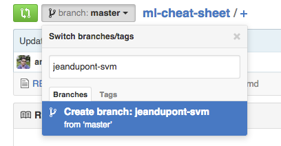
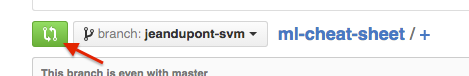

# Contributing to the ml-cheat-sheet

If you are reading this, I would like to thank you for your interest for bringing your knowledge to our Machine Learning Cheat Sheet.


This is a short tutorial for beginners to show how to contribute to our cheatsheet using the Github workflow ! We will see the power of Github when multiple people want to work on the same file. Let's get started !


Multiple people working on the same file is problematic.
Let's say A and are working on the same file simultaneously. While A was working on a existing paragraph, B corrected mistakes in the same paragraph. This situation creates a **conflict**.
**To solve this problem, we use the Github branches**.

## Basic workflow
Every github repository has a ```master``` branch. This master branch is very important :


The first convention we will adopt is that :

    The master branch is used as the reference. This is the unique source of truth.


This means that you should only push clean files to the master branch.

Let's see how to use branches to collaborate on the same file. Let's say the ```master``` branch has a ```cheatsheet.tex```.


I want to add my contribution to the ```cheatsheet.tex``` file.  
###  Creating a branch

1. First thing to do is to create a new branch from Github. The convention we chose is to format the branch like this : *[yourgithubusername]-[the task you are doing]*. (For instance : *mohammedtang-svm*)



2. In your terminal, retrieve the new branch by issuing : ``` git pull ```
3. Switch to your new branch : ```git checkout mohammedtang-svm```

### Start working on your file and push modifications to your branch

Having your own branch is like having your isolated version of the repostory.
Let's say that I add modifications to the ```cheatsheet.tex``` and add a paragraph in the section about SVMs.

1. Add your modifications to the index : ```git add cheatsheet.tex```
2. Commit your changes : ``` git commit -m "Added modifications to SVM"```
3. Push your changes to your branch : ``` git push origin mohammedtang-svm```

### Merging your work to the master branch

Your section is completed and you are ready to release it to the world. To do this, you have to merge **your branch** to the ```master``` branch.

1. Integrate remote changes to your branch : ```git merge master```
2. **This will integrate the changes that occured in the master branch while you were working on your branch**. It may result in **conflicts**.
3. If you have conflicts, they will be added to the file that have conflicts. This is your job to tidy the conflicted file, to commit the changes, and push it to your branch.

### Creating a pull request

By clicking on the green button, you can create a pull-request.
By making a pull request, you are asking the permission to merge your branch into the master branch.



Contributors will be able to check the modifications you made and validate them. When your contribution is validated, it can be merged to the master branch.

** Congratulation you just made your first contribution !**
